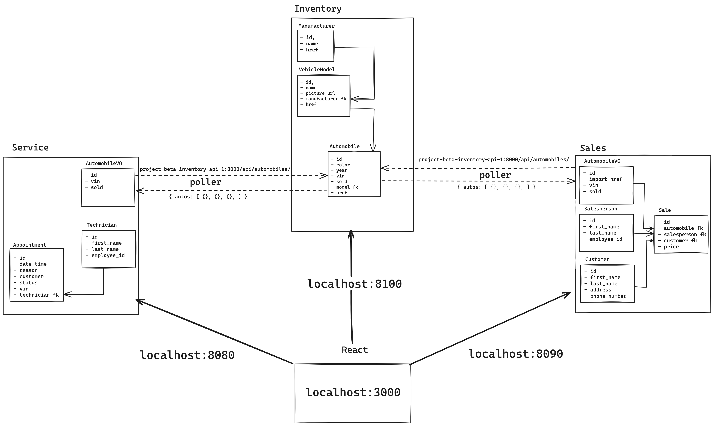

# CarCar

Team:

* Person 1 - Russ Moore - Service
* Person 2 - Kyle Hodges - Sales

## Getting Started

**Make sure you have Docker, Git, and Node.js 18.2 or above**

1. Fork this repository
****
2. Clone the forked repository onto your local computer:
git clone https://gitlab.com/RussMoore/project-beta

3. Build and run the project using Docker with these commands in the terminal:
```
$docker volume create beta-data
$docker-compose build
$docker-compose up
```
- After running these commands, make sure all of your Docker containers are running.

- View the project in the browser: http://localhost:3000/
* Person 1 - Russ Moore - Service
* Person 2 - Kyle Hodges - Sales

## Design

Diagram:


HIGH LEVEL OVERVIEW

This program contains three primary API's serving three different microservices Inventory, Sales, and Service. These API's can work independently of one another and have increased functionality when working together. Each API has a dedicated port assigned to it allowing the microservices to communicate over a poller transfering data from one end-point to another. In particular the Inventory microservice holds data pertaining to automobiles and inventory of those vehicles. The Sales and Service microservices retrieve data from Inventory through separate pollers.

## API Documentation

### Inventory microservice
MANUFACTURER:
| Action | Method | URL|
| ------ | ------ | -- |
| List Manufacturers | GET | http://localhost:8100/api/manufacturers/ |
| Create Manufacturer | POST | http://localhost:8100/api/manufacturers/ |
| Get Manufacturer detail | GET | http://localhost:8100/api/manufacturers/id/ |
| Update Manufacturer | PUT | http://localhost:8100/api/manufacturers/id/ |
| Delete Manufacturer | DELETE | http://localhost:8100/api/manufacturers/id/ |

These API endpoints serves as a part of the Inventory microservice that enables a user to create a new manufacturer, recieve a list of manfucaturers, recieve specific details on an individual manufacturer, update those details, and lastly, to delete a specific manufacturer.


LIST MANUFACTURERS:
Following this end-point will get a list of all of the manufacturers that exist in the database. The request utilizes the GET method, therefore, no information is required.
```
Example:
{
    "manufacturers": [
        {
            "href": "/api/manufacturers/1/",
            "id": 1,
            "name": "Chrysler"
        }
    ]
}
```

CREATE MANUFACTURERS:
This end-point allows a user to add a manufacturer to the database. It has required data input. All new manufacturers require a "name" as the only input field.

```
Example:
{
  "name": "Chrysler"
}
```

GET MANUFACTURER DETAIL:
Following this end-point will get the deatils of a specific manufacturer that exists in the database. The request utilizes the GET method and only the id of the manufacturere is required. The URL used to see the below example's detail would be http://localhost:8100/api/manufacturers/1/
```
Example:
{
	"href": "/api/manufacturers/1/",
	"id": 1,
	"name": "Chrysler"
}
```

UPDATE MANUFACTURER DETAIL:
Following this end-point will allow the user to update deatils of a specific manufacturer in the database. The request utilizes the PUT method and only the id of the manufacturere is required. The URL used to update the below example's detail would be http://localhost:8100/api/manufacturers/1/
```
Example:
{
  "name": "Chrysler"
}
```

DELETE MANUFACTURER:
Deleting a manufacturer can be acheived by utilizing the "Delete Manufacturer" end-point. The DELETE request uses the same endpoint as detail and update. The user only needs to know the id of the specific manufacturer that requires deletion.
```
Example:
http://localhost:8100/api/manufacturers/1/
```

VEHICLE MODELS:
| Action | Method | URL|
| ------ | ------ | -- |
| List Vehicle Models | GET | http://localhost:8100/api/models/ |
| Create Model | POST | http://localhost:8100/api/models/ |
| Get Model detail | GET | http://localhost:8100/api/models/id/ |
| Update Model | PUT | http://localhost:8100/api/models/id/ |
| Delete Model | DELETE | http://localhost:8100/api/models/id/ |

These API endpoints serves as a part of the Inventory microservice that enables a user to create a new vehicle model, recieve a list of models, recieve specific details on an individual vehicle model, update those details, and lastly, to delete a specific model.

LIST VEHICLE MODELS:
Following this end-point will get a list of all of the models that exist in the database. The request utilizes the GET method, therefore, no information is required.
```
Example:
{
    "models": [
        {
            "href": "/api/models/1/",
            "id": 1,
            "name": "Sebring",
            "picture_url": "https://upload.wikimedia.org/wikipedia/commons/thumb/7/71/Chrysler_Sebring_front_20090302.jpg/320px-Chrysler_Sebring_front_20090302.jpg",
            "manufacturer": {
                "href": "/api/manufacturers/1/",
                "id": 1,
                "name": "Chrysler"
            }
        }
  ]
}
```

CREATE MODEL:
This end-point allows a user to add a vehicle model to the database. It has required data input. All new models require a "name", "picture_url", and "manufacturer_id".

```
Example:
{
  "name": "Sebring",
  "picture_url": "https://upload.wikimedia.org/wikipedia/commons/thumb/7/71/Chrysler_Sebring_front_20090302.jpg/320px-Chrysler_Sebring_front_20090302.jpg",
  "manufacturer_id": 1
}
```

GET MODEL DETAIL:
Following this end-point will get the deatils of a specific vehicle model that exists in the database. The request utilizes the GET method and only the id of the model is required. The URL used to see the below example's detail would be http://localhost:8100/api/models/1/
```
Example:
{
	"href": "/api/models/1/",
    "id": 1,
    "name": "Sebring",
    "picture_url": "https://upload.wikimedia.org/wikipedia/commons/thumb/7/71/Chrysler_Sebring_front_20090302.jpg/320px-Chrysler_Sebring_front_20090302.jpg",
    "manufacturer": {
        "href": "/api/manufacturers/1/",
        "id": 1,
        "name": "Chrysler"
    }
}
```

UPDATE MODEL DETAIL:
Following this end-point will allow the user to update deatils of a specific vehicle model in the database. The request utilizes the PUT method and only the id of the model is required. The URL used to update the below example's detail would be http://localhost:8100/api/models/1/
```
Example:
{
    "name": "Sebring",
    "picture_url": "https://upload.wikimedia.org/wikipedia/commons/thumb/7/71/Chrysler_Sebring_front_20090302.jpg/320px-Chrysler_Sebring_front_20090302.jpg"
}
```

DELETE MODEL:
Deleting a vehicle model can be acheived by utilizing the "Delete Model" end-point. The DELETE request uses the same end-point as detail and update. The user only needs to know the id of the specific vehicle model that requires deletion.
```
Example:
http://localhost:8100/api/models/1/
```

AUTOMOBILES:
| Action | Method | URL|
| ------ | ------ | -- |
| List Automobiles | GET | http://localhost:8100/api/automobiles/ |
| Create Automobile | POST | http://localhost:8100/api/automobiles/ |
| Get Automobile detail | GET | http://localhost:8100/api/automobiles/id/ |
| Update Automobile | PUT | http://localhost:8100/api/automobiles/id/ |
| Delete Automobile | DELETE | http://localhost:8100/api/automobiles/id/ |

These API endpoints serves as a part of the Inventory microservice that enables a user to create a new automobile, recieve a list of automobiles, recieve specific details on an individual automobile, update those details, and lastly, to delete a specific automobile.

LIST AUTOMOBILES:
Following this end-point will get a list of all of the automobiles that exist in the database. The request utilizes the GET method, therefore, no information is required.
```
Example:
{
    "autos": [
        {
            "href": "/api/automobiles/1C3CC5FB2AN120174/",
            "id": 1,
            "color": "yellow",
            "year": 2013,
            "vin": "1C3CC5FB2AN120174",
            "model": {
                "href": "/api/models/1/",
                "id": 1,
                "name": "Sebring",
                "picture_url": "https://upload.wikimedia.org/wikipedia/commons/thumb/7/71/Chrysler_Sebring_front_20090302.jpg/320px-Chrysler_Sebring_front_20090302.jpg",
                "manufacturer": {
                "href": "/api/manufacturers/1/",
                "id": 1,
                "name": "Chrysler"
                }
            },
            "sold": false
        }
  ]
}
```

CREATE AUTOMOBILE:
This end-point allows a user to add an automobile to the database. It has required data input. All new automobiles require a "color", "year", "vin", and "model_id".

```
Example:
{
    "color": "red",
    "year": 2012,
    "vin": "1C3CC5FB2AN120174",
    "model_id": 1
}
```

GET AUTOMOBILE DETAIL:
Following this end-point will get the deatils of a specific automobile that exists in the database. The request utilizes the GET method and only the id of the automobile is required. The URL used to see the below example's detail would be http://localhost:8100/api/automobiles/1/
```
Example:
{
	"href": "/api/automobiles/1C3CC5FB2AN120174/",
    "id": 1,
    "color": "yellow",
    "year": 2013,
    "vin": "1C3CC5FB2AN120174",
    "model": {
        "href": "/api/models/1/",
        "id": 1,
        "name": "Sebring",
        "picture_url": "https://upload.wikimedia.org/wikipedia/commons/thumb/7/71/Chrysler_Sebring_front_20090302.jpg/320px-Chrysler_Sebring_front_20090302.jpg",
        "manufacturer": {
        "href": "/api/manufacturers/1/",
        "id": 1,
        "name": "Chrysler"
        }
    },
    "sold": false
}
```

UPDATE AUTOMOBILE DETAIL:
Following this end-point will allow the user to update deatils of a specific automobile in the database. The request utilizes the PUT method and only the id of the automobile is required. The URL used to update the below example's detail would be http://localhost:8100/api/automobiles/1/
```
Example:
{
    "color": "red",
    "year": 2012,
    "sold": true
}
```

DELETE AUTOMOBILE:
Deleting an automobile can be acheived by utilizing the "Delete Automobile" end-point. The DELETE request uses the same end-point as detail and update. The user only needs to know the id of the specific automobile that requires deletion.
```
Example:
http://localhost:8100/api/automobiles/1/
```

### Service microservice


The Service microservice tracks, stores, and implements several facets of the program.  Sales microservice has a Technician model, Appointment model, and an AutomobileVO model.  The models are all manipulated directly in the Service microservice with the exception of the AutomobileVO model which receives its data via a poller located in [service/poll/poller.py] that grabs automobile data from the Inventory microservice Automobile model. Technician is a foreign key of the Appointment model (making an appointment requires the user to assign a technician to be responsible for the servicing of the vehicle). The customer name is a custom text entry that does not link the customer name to an existing customer in a database.

Technicians:
| Action | Method | URL|
| ------------------ | ------ | ----------------------------------------------- |
| List Technicians   | GET    | http://localhost:8080/api/technicians/          |
| Create Technicians | POST   | http://localhost:8080/api/technicians/          |
| Delete Technicians | DELETE | http://localhost:8080/api/technicians/<int:id>/ |

These API endpoints serves as a part of the Service microservice that enables a user to create a new technician, recieve a list of technicians, and to delete a specific technician.

LIST TECHNICIANS:
Following this end-point will get a list of all of the technician that exist in the database. The request utilizes the GET method, therefore, no information is required.
```
Example:
{
	"techs": [
		{
			"first_name": "Hank",
			"last_name": "Hill",
			"employee_id": "hhill",
			"id": 1
		}
	]
}
```

CREATE TECHNICIAN:
This end-point allows a user to add a customer to the database. It has required data input. All new customers require a "first_name", "last_name", and "employee_id".

```
Example:
{
"first_name": "Hank",
"last_name": "Hill",
"employee_id": "hhill"
}
```

DELETE TECHNICIAN:
Deleting a technician can be acheived by utilizing the "Delete Technician" end-point. The DELETE request uses the same end-point as list and create with the added id at the end. The user only needs to know the id of the specific technician that requires deletion.
```
Example:
http://localhost:8080/api/technicians/1/
```

Appointments:
|              Action                     | Method |                 URL                              |
| --------------------------------------- | ------ | ------------------------------------------------ |
| List Appointments                       | GET    | http://localhost:8080/api/appointments/          |
| Create Appointments                     | POST   | http://localhost:8080/api/appointments/          |
| Delete Appointment                      | DELETE | http://localhost:8080/api/appointments/2/        |
| Set Appointments Status To 'cancelled'  | PUT    | http://localhost:8080/api/appointments/1/cancel/ |
| Set Appointments Status To 'finished'   | PUT    | http://localhost:8080/api/appointments/1/finish/ |

These API endpoints serves as a part of the Service microservice that enables a user to create a new Appointment, recieve a list of Appointments, delete a specific Appointment, set a specific appointment status to 'cancelled' and set a specific appointment status to 'finished'.

LIST APPOINTMENTS:
Following this end-point will get a list of all of the appointments that exist in the database. The request utilizes the GET method, therefore, no information is required.
```
Example:
{
	"appointments": [
		{
			"id": 1,
			"date_time": "2023-12-21T21:00:00+00:00",
			"customer": "Bobby Hill",
			"reason": "wont start",
			"status": "CREATED",
			"vin": "12345678901234567",
			"technician": {
				"first_name": "Hank",
				"last_name": "Hill",
				"employee_id": "hhill",
				"id": 1
			}
		}
	]
}
```

CREATE APPOINTMENTS:
This end-point allows a user to add an appointment to the database. It has required data input. All new appointments require a "date_time", "reason", "status", "vin", "customer", and a "technician" id.

```
Example:
{
"date_time": "2024-01-01T12:30:00",
"reason": "car is making squeek",
"status": "CREATED",
"vin": "1C3CC5FB2AN120174",
"customer": "Bobby Hill",
 "technician": "1"
}
```

DELETE TECHNICIAN:
Deleting an appointment can be acheived by utilizing the "Delete Technician" end-point. The DELETE request uses the same end-point as list and create with the added id at the end. The user only needs to know the id of the specific appointment that requires deletion.
```
Example:
http://localhost:8080/api/appointments/1/
```

SET APPOINTMENT STATUS TO 'cancelled':
Setting an appointment can be acheived by utilizing the "Set Appointments Status To 'cancelled'" end-point. The PUT request uses the same end-point as delete with the added 'cancel' at the end. The user only needs to know the id of the specific appointment that requires the status code change, similar to the delete end-point.

```
Example:
http://localhost:8080/api/appointments/1/cancel/
```

SET APPOINTMENT STATUS TO 'finished':
Setting an appointment can be acheived by utilizing the "Set Appointments Status To 'finished'" end-point. The PUT request uses the same end-point as delete with the added 'finish' at the end. The user only needs to know the id of the specific appointment that requires the status code change, similar to the delete end-point.

```
Example:
http://localhost:8080/api/appointments/1/finish/
```


AUTOMOBILESVOS:
|      Action          | Method |                URL                        |
| -------------------- | ------ | ----------------------------------------- |
| List AutomobileVOs   | GET    | http://localhost:8080/api/automobiles/    |


This API endpoint serves as a part of the Service microservice that enables a user to list the AutomobileVOs. This is primarily used by the front end to check if a vin exists in the database.

LIST AUTOMOBILEVOS:
Following this end-point will get a list of all of the automobileVOs that exist in the database. The request utilizes the GET method, therefore, no information is required.
```
Example:
{
	"autos": [
		{
			"vin": "1C3CC5FB2AN120814",
			"sold": true
		}
	]
}
```

### Sales microservice

The Sales microservice tracks, stores, and implements several facets of the program.  Sales microservice has a Sale model, Salesperson model, Customer model, and an AutomobileVO model.  The models are all manipulated directly in the Sales microservice with the exception of the AutomobileVO model which receives its data via a poller located in [sales/poll/poller.py] that grabs automobile data from the Inventory microservice Automobile model. Salesperson, Customer, and AutomobileVO all serve as Foriegn Keys for the Sale model.

CUSTOMER:
| Action | Method | URL|
| ------ | ------ | -- |
| List Customers | GET | http://localhost:8090/api/customers/ |
| Create Customer | POST | http://localhost:8090/api/customers/ |
| Delete Customer | DELETE | http://localhost:8090/api/customers/id/ |

These API endpoints serves as a part of the Sales microservice that enables a user to create a new customer, recieve a list of customers, and to delete a specific customer.

LIST CUSTOMERS:
Following this end-point will get a list of all of the customers that exist in the database. The request utilizes the GET method, therefore, no information is required.
```
Example:
{
	"customers": [
		{
			"first_name": "Peter",
			"last_name": "Pan",
			"address": "2nd Star Ave, Neverland",
			"phone_number": "(800)-555-1234",
			"id": 1
		}
    ]
}
```

CREATE CUSTOMER:
This end-point allows a user to add a customer to the database. It has required data input. All new customers require a "first_name", "last_name", "address", and "phone_number".

```
Example:
{
    "first_name": "Peter",
	"last_name": "Pan",
	"address": "2nd Star Ave, Neverland",
	"phone_number": "(800)-555-1234"
}
```

DELETE CUSTOMER:
Deleting a customer can be acheived by utilizing the "Delete Customer" end-point. The DELETE request uses the same end-point as list and create with the added id at the end. The user only needs to know the id of the specific customer that requires deletion.
```
Example:
http://localhost:8100/api/customers/1/
```

SALESPERSON:
| Action | Method | URL|
| ------ | ------ | -- |
| List Salespeople | GET | http://localhost:8090/api/salespeople/ |
| Create Salesperson | POST | http://localhost:8090/api/salespeople/ |
| Delete Salesperson | DELETE | http://localhost:8090/api/salespeople/id/ |

These API endpoints serves as a part of the Sales microservice that enables a user to create a new salesperson, recieve a list of salespeople, and to delete a specific salesperson.

LIST SALESPEOPLE:
Following this end-point will get a list of all of the salespeople that exist in the database. The request utilizes the GET method, therefore, no information is required.
```
Example:
{
	"salespeople": [
		{
			"first_name": "James",
			"last_name": "Hook",
			"employee_id": "jhook",
			"id": 1
        }
    ]
}
```

CREATE SALESPERSON:
This end-point allows a user to add a salesperson to the database. It has required data input. All new salespeople require a "first_name", "last_name", and "employee_id".

```
Example:
{
    "first_name": "James",
	"last_name": "Hook",
	"employee_id": "jhook",
}
```

DELETE SALESPERSON:
Deleting a salesperson can be acheived by utilizing the "Delete Salesperson" end-point. The DELETE request uses the same end-point as list and create with the added id at the end. The user only needs to know the id of the specific salesperson that requires deletion.
```
Example:
http://localhost:8100/api/salespeople/1/
```


SALE:
| Action | Method | URL|
| ------ | ------ | -- |
| List Sales | GET | http://localhost:8090/api/sales/ |
| Create Sale | POST | http://localhost:8090/api/sales/ |
| Delete Sale | DELETE | http://localhost:8090/api/sales/id/ |

These API endpoints serves as a part of the Sales microservice that enables a user to create a new sale, recieve a list of sales, and to delete a specific sale.

LIST SALES:
Following this end-point will get a list of all of the sales that exist in the database. The request utilizes the GET method, therefore, no information is required.
```
Example:
{
	"sales": [
		{
			"automobile": {
				"import_href": "/api/automobiles/1C3CC5FB2AN120814/",
				"vin": "1C3CC5FB2AN120814",
				"sold": true
			},
			"salesperson": {
				"first_name": "James",
				"last_name": "Hook",
				"employee_id": "jhook",
				"id": 1
			},
			"customer": {
				"first_name": "Peter",
				"last_name": "Pan",
				"address": "2nd Star Ave, Neverland",
				"phone_number": "(800)-555-1234",
				"id": 1
			},
			"price": "$17500.00",
			"id": 1
		}
    ]
}
```

CREATE SALE:
This end-point allows a user to add a sale to the database. It has required data input. All new sales require an "automobile" which is the import_href value from the AutomobileVO model, "salesperson" which is the id value from the Salesperson model, "customer" which is the id value from the Customer model, and "price".  When a sale is created, a PUT request is sent to the Inventory microservice Automobile API changing the value of "sold" to "true". This is then pulled into the Sales microservice AutomobileVO model via the poller and then translated into the Sale model via the foreign key.

```
Example:
{
    "automobile": "/api/automobiles/1C3CC5FB2AN120814/",
	"salesperson": 1,
	"customer": 1,
	"price": 17500.00
}
```

DELETE SALE:
Deleting a sale can be acheived by utilizing the "Delete Sale" end-point. The DELETE request uses the same end-point as list and create with the added id at the end. The user only needs to know the id of the specific sale that requires deletion.
```
Example:
http://localhost:8100/api/sales/1/
```
